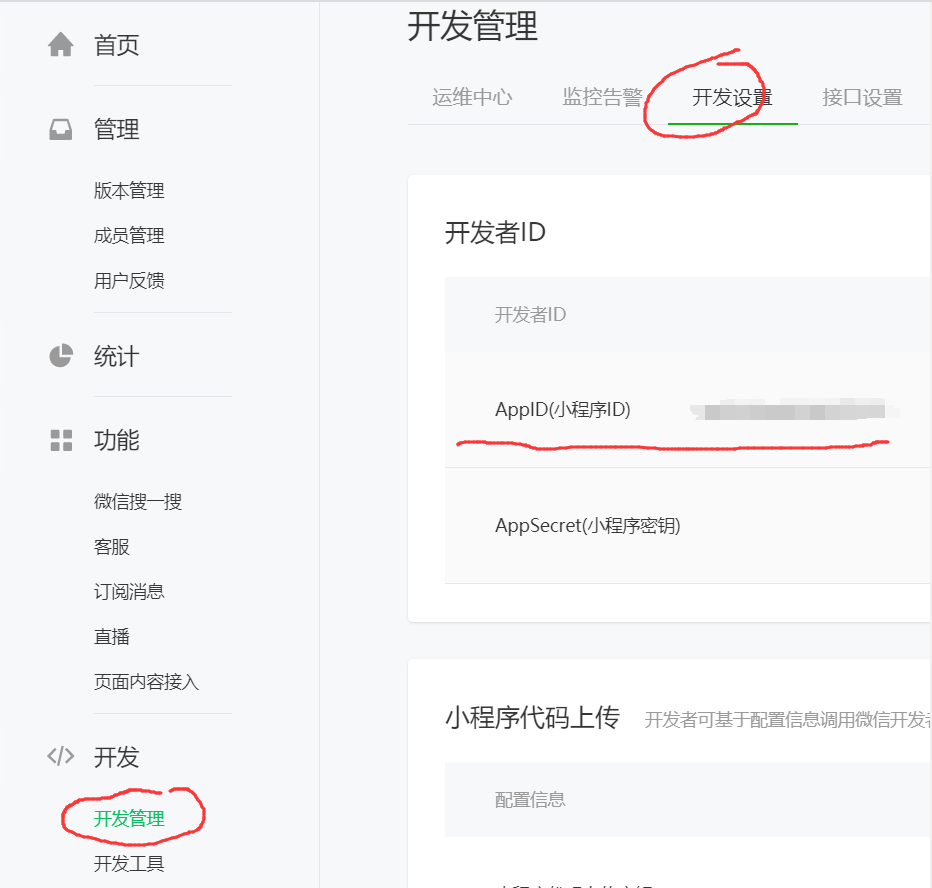

# 微信小程序

文档地址：https://developers.weixin.qq.com/miniprogram/dev/framework/quickstart/getstart.html#%E7%94%B3%E8%AF%B7%E5%B8%90%E5%8F%B7

注册开发者账号：（这一步是不是可以跳过）

申请小程序：https://mp.weixin.qq.com/

下载开发者工具：https://developers.weixin.qq.com/miniprogram/dev/devtools/download.html

## 微信小程序是什么？
是一个基于微信app为开发和运行环境的一个小性软件

## 开发流程
- 申请小程序：https://mp.weixin.qq.com/
    - 注册并填入小程序详细信息
- 创建项目：
    - 其中AppId来自于：
    
- 编写代码