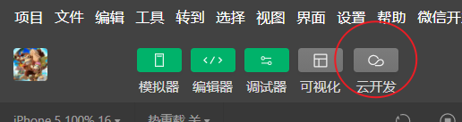
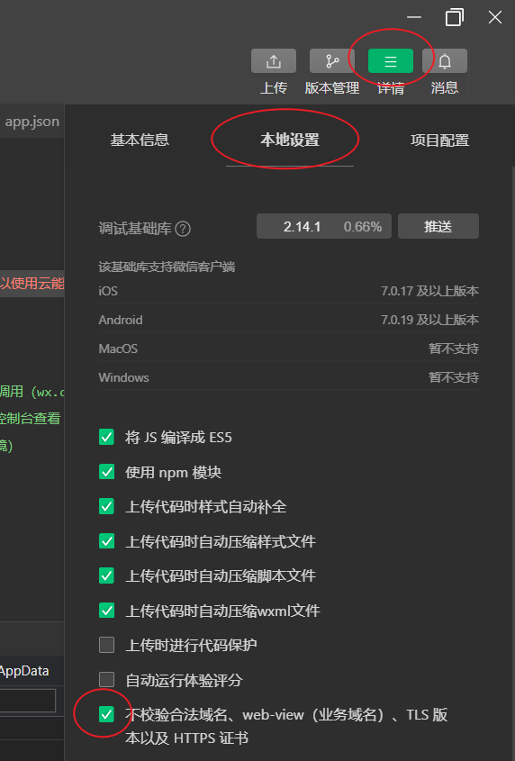

# 云环境

## 什么是环境
程序运行的一个平台

一般开发来说有以下几种环境：

1. 开发环境：运行开发代码的
2. 生产环境：运行正式上线的代码的
3. 测试环境：运行测试代码的
4. 预发布环境：发布正式版前进行一个稳定测试的环境（可能采用线上数据库）

## 什么是云环境
云端（远程端）的运行程序的平台

## 云开发控制台
登录开发者工具，并在左上角找到云开发按钮

此时打开的窗口称为云开发控制台

可以在控制台上查看云函数 云数据库 云存储 和 云环境

## 使用第三方接口
若要使用第三方非小程序云的接口时，需要在小程序后台添加信任接口地址，为了开发方便可以在开发者工具中跳过接口验证，方法：选择右上角详情->本地设置->勾选不校验合法域名

