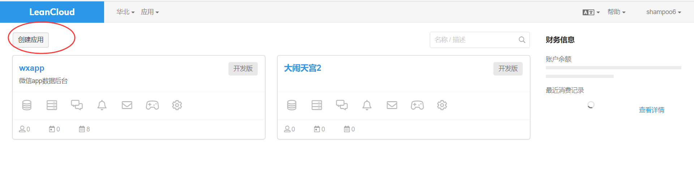
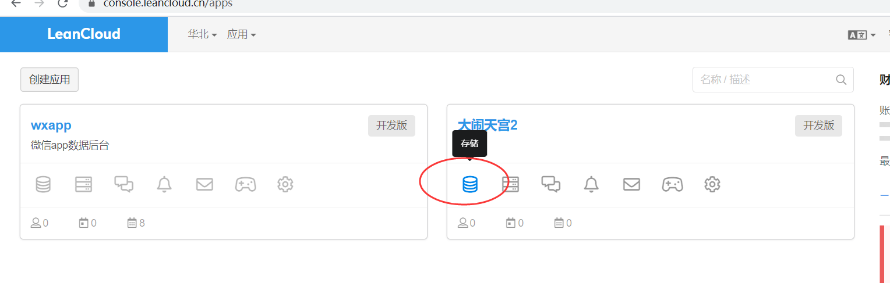
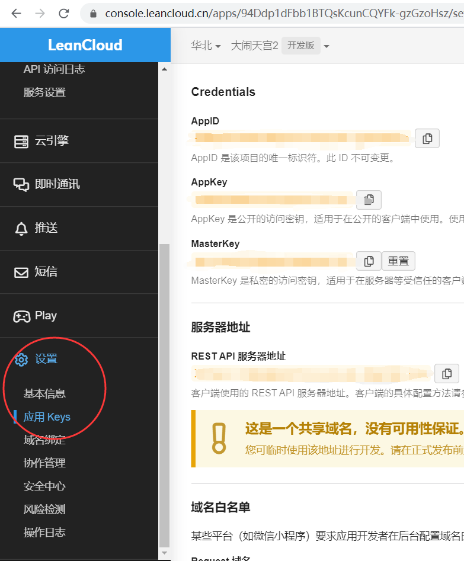

# LeanCloud简介

官网: https://www.leancloud.cn/

## 云服务是什么？
云，指的是云端，也就是互联网上的远程端

云服务：远程端提供的服务，就叫云服务。

例如：百度云，阿里云，腾讯云

## LeanCloud介绍
LeanCloud就云服务商家中的一家，它简单方便的提供了数据库云服务。

## LeanCloud的作用
LeanCloud可以为我们提供远程服务器和数据库，我们在开发小程序时，需要使用数据库，将数据存储下来，所以我们要用到LeanCloud的数据库服务

## SDK 是啥？
sdk是云服务平台提供的开发工具，用于用户在客户端访问云平台的云服务

## 下载sdk
地址：https://cdn.jsdelivr.net/npm/leancloud-storage@4.10.1/dist/av-min.js

## 开发流程：
### 安装sdk
在html当中，使用script标签直接引入

### 创建应用
在LeanCloud登录后台，点击创建应用按钮创建一个应用

创建好后，点击应用的存储按钮，进入控制台后，点击侧边栏中的 设置->应用keys 找到和自己应用相关的参数

### 初始化sdk
详见：《安装LeanCloundSDK.html》
