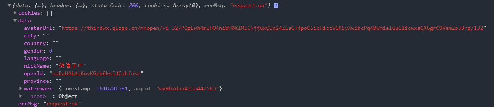

# 微信授权

文档：https://developers.weixin.qq.com/miniprogram/dev/framework/open-ability/authorize.html

有些操作需要获得用户的授权才能使用，例如：获取用户的微信信息，定位信息等

此时需要用户授权

## 授权方法
文档：https://developers.weixin.qq.com/miniprogram/dev/api/open-api/authorize/wx.authorize.html

调用 wx.authorize 进行授权

通常来说，我们建议在授权前，先查看用户已经拥有哪些权限，可以使用 wx.getSetting(文档：https://developers.weixin.qq.com/miniprogram/dev/api/open-api/setting/wx.getSetting.html)

> 注意：用户授权中有个例外，wx.getUserInfo 的授权不能使用 wx.authorize，而是使用按钮，例如：`<button open-type="getUserInfo"/>`

> 注意：用户获取用户信息成功后可以触发一个回调函数，方法如下：`<button open-type="getUserInfo" bindgetuserinfo="onGetUserInfo"/>`，只需要在授权按钮中加入 bindgetuserinfo 属性，绑定一个回调函数即可

## 获取用户的敏感数据
微信提供了获取敏感数据的方法，敏感数据包含以下字段

获取的方法和过程如下：

- 自行搭建一个服务器，此处以node.js的express服务器为例
- 微信端用户登录时，获取的 code 发送给开发者服务器
- 服务器调用微信提供的接口(`https://api.weixin.qq.com/sns/jscode2session?appid=${appId}&secret=${secret}&js_code=${code}&grant_type=authorization_code`)，解密 code 获取 session_key
    - 其中的secret需要在获取appid的页面中获取appSecret
- 下载微信解密demo(<link>https://res.wx.qq.com/wxdoc/dist/assets/media/aes-sample.eae1f364.zip</link>)
- 在服务器中创建解密接口，利用解密demo，进行解密

解密过程，可参考《wx-client-server》项目的 `src/app.js`